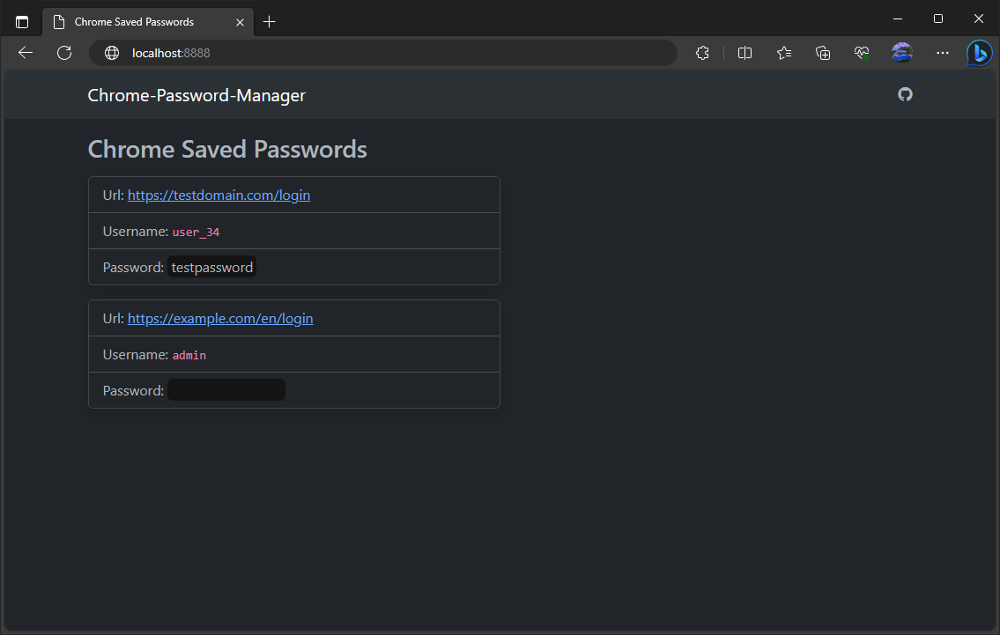

# Chrome-Password-Manager
Flask based web application to the **Google Chrome** saved passwords in ur computer.

## Usage

### Install requirements
Install all the requirements using the **Python Package Installer** (`pip`) by running this command in the root directory of the project:
```
$ pip install -r requirements.txt
```

### Run the application
> On **localhost**

To start the Flask server, execute `app.py`, so the application will start running at your HTTP port `8888` (by default).
```
$ python app.py
```

Once the application is running, open `localhost:8888` or `127.0.0.1:8888` to view the web interface.

## Demo
